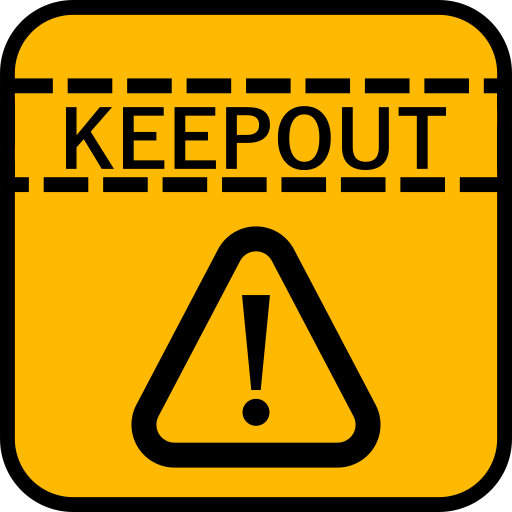

# keepout



Avoid using the computer outside the time limit.
When soft limit, `keepout` show a message.
When hard limit, `keepout` show a message and spread a mask on the desktop.
If you put `Escape` key and `password`, then `keepout` will be terminated.

# Install

1. Download keepout release from [Release Page](https://github.com/otahi/keepout/releases/latest).
2. Put the `keepout` binary in your favorite directory.
3. Make a shortcut to the `keepout` binary in your favorite directory.
4. Put the shortcut to your startup directory.
  - `%AppData%\Microsoft\Windows\Start Menu\Programs\Startup`

# Usage

1. Run the `keepout` binary.
    - `keepout` creates a configuration file to a directory.
      - `%AppData%\keepout\keepout.json`
2. Edit your configuraiton file.
  - `%AppData%\keepout\keepout.json`
3. Run the `keepout` binary again.

# Configuration

`password` is for stop `keepout`.
`soft` and `hard` are for the soft and hard time limit and messages to show.

```json
{
  "password": "password",
  "soft": {
    "start": "22:50",
    "end": "03:10",
    "message" : "It's almost 23:00.",
  },
  "hard": {
    "start": "23:00",
    "end": "03:00",
    "message" : "It's already 23:00.",
  }
}
```

# License

[MIT License](LICENSE)